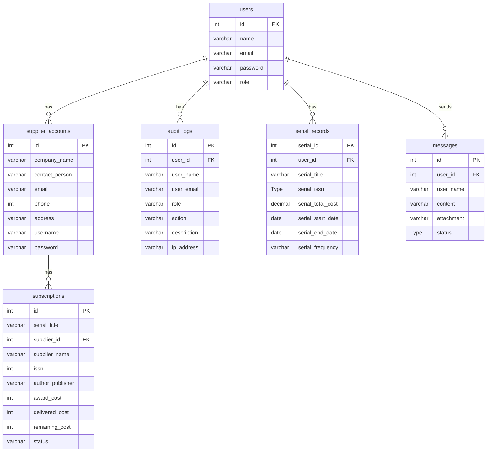

# Entity Relationship Diagram — Serial Subscription Tracking System

> This Mermaid ERD is auto-rendered by GitHub. To export as an image, paste the code block into [mermaid.live](https://mermaid.live) and click **Download PNG/SVG**.

